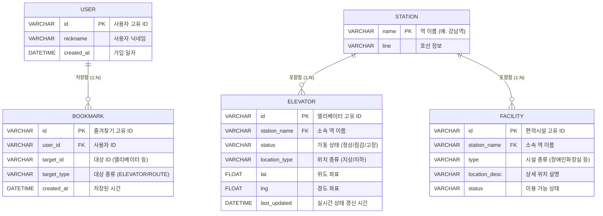

# MetroLift ERD 명세서 (Entity Relationship Diagram)

본 문서는 `API_SPEC.md`를 바탕으로 도출된 데이터베이스 구조 명세서입니다. (요청하신 대로 게시판/피드백 관련 테이블은 제외되었습니다.)

> 💡 **교육용 주석 (ERD와 데이터베이스 용어)**
> - **ERD (Entity Relationship Diagram)**: 건물을 짓기 전 그리는 '설계도'처럼, 데이터들이 서로 어떻게 얽혀있는지 그려놓은 데이터베이스 설계도입니다.
> - **Table (테이블/엔티티)**: 엑셀의 '시트'와 같습니다. (예: 사용자 시트, 엘리베이터 시트)
> - **Column (컬럼/속성)**: 엑셀의 '세로줄(항목)'입니다. (예: ID, 이름, 위도, 경도)
> - **Type (데이터 타입)**: 그 항목에 들어갈 내용물의 종류입니다. 문자열(VARCHAR), 숫자(FLOAT, INT), 날짜시간(DATETIME) 등이 있습니다.
> - **PK (Primary Key, 기본키)**: 각 데이터를 절대 헷갈리지 않게 구분해주는 고유 번호입니다. (사람의 '주민등록번호' 역할)
> - **FK (Foreign Key, 외래키)**: 다른 테이블에 있는 정보를 가리키기 위해 적어두는 '참조 번호'입니다.

---

## 1. ERD 다이어그램 시각화

아래는 각 테이블(데이터) 간의 관계를 보여주는 다이어그램입니다.

---

## 2. 테이블 상세 명세

### 2.1 USER (사용자 테이블)
앱을 사용하는 사용자의 정보를 저장합니다.

| 컬럼명 (Column) | 타입 (Type) | 제약조건 | 설명 (Description) |
| :--- | :--- | :--- | :--- |
| `id` | VARCHAR(50) | **PK** | 사용자 고유 식별자 (예: user_123) |
| `nickname` | VARCHAR(50) | NOT NULL | 사용자 닉네임 또는 익명 ID |
| `created_at` | DATETIME | NOT NULL | 계정 생성 일시 |

### 2.2 STATION (지하철역 테이블)
엘리베이터와 편의시설이 소속된 기준이 되는 '역' 정보입니다.

| 컬럼명 (Column) | 타입 (Type) | 제약조건 | 설명 (Description) |
| :--- | :--- | :--- | :--- |
| `name` | VARCHAR(50) | **PK** | 역 이름 (예: 강남역) |
| `line` | VARCHAR(20) | | 지하철 호선 (예: 2호선) |

### 2.3 ELEVATOR (엘리베이터 테이블)
핵심 기능인 엘리베이터의 위치 좌표와 실시간 상태를 담습니다.

| 컬럼명 (Column) | 타입 (Type) | 제약조건 | 설명 (Description) |
| :--- | :--- | :--- | :--- |
| `id` | VARCHAR(50) | **PK** | 엘리베이터 고유 식별자 (예: E001) |
| `station_name` | VARCHAR(50) | **FK** | 소속된 역 이름 (STATION.name 참조) |
| `status` | VARCHAR(20) | NOT NULL | 실시간 상태 (정상, 점검, 고장) |
| `location_type` | VARCHAR(20) | NOT NULL | 지상/지하 구분 |
| `lat` | FLOAT | NOT NULL | WGS84 위도 좌표 |
| `lng` | FLOAT | NOT NULL | WGS84 경도 좌표 |
| `last_updated` | DATETIME | NOT NULL | 공공데이터 API로부터 상태 갱신된 시간 |

### 2.4 FACILITY (교통약자 편의시설 테이블)
장애인 화장실, 휠체어 급속충전기 등의 정보를 담습니다.

| 컬럼명 (Column) | 타입 (Type) | 제약조건 | 설명 (Description) |
| :--- | :--- | :--- | :--- |
| `id` | VARCHAR(50) | **PK** | 편의시설 고유 식별자 (예: F001) |
| `station_name` | VARCHAR(50) | **FK** | 소속된 역 이름 (STATION.name 참조) |
| `type` | VARCHAR(50) | NOT NULL | 시설 종류 (예: 장애인 화장실, 충전기) |
| `location_desc`| VARCHAR(255)| NOT NULL | 위치에 대한 상세 설명 |
| `status` | VARCHAR(50) | | 이용 가능 상태 |

### 2.5 BOOKMARK (즐겨찾기 테이블)
사용자가 자주 가는 경로 혹은 엘리베이터를 즐겨찾기한 내역입니다.

| 컬럼명 (Column) | 타입 (Type) | 제약조건 | 설명 (Description) |
| :--- | :--- | :--- | :--- |
| `id` | VARCHAR(50) | **PK** | 즐겨찾기 고유 식별자 |
| `user_id` | VARCHAR(50) | **FK** | 등록한 사용자 ID (USER.id 참조) |
| `target_id` | VARCHAR(50) | NOT NULL | 즐겨찾기 대상의 ID (예: E001) |
| `target_type` | VARCHAR(20) | NOT NULL | 즐겨찾기 대상 종류 (ELEVATOR, ROUTE 등) |
| `created_at` | DATETIME | NOT NULL | 즐겨찾기에 추가한 일시 |

> 💡 **참고**: 길 찾기 동선(Route) 정보는 데이터베이스 표에 고정해서 저장하기보다는, 출발역과 도착역이 주어질 때마다 알고리즘을 통해 실시간으로 계산해서 응답하는 것이 일반적입니다. 따라서 ERD 테이블에서는 제외하였습니다.
